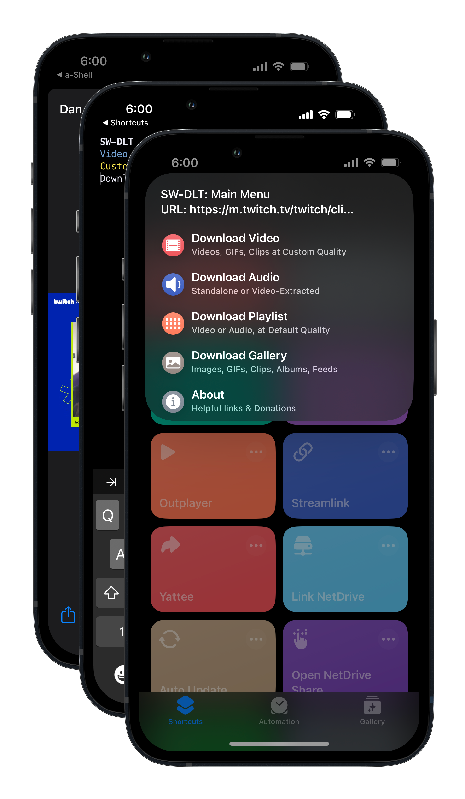

# SW-DLT

SW-DLT ("Shortcuts Wrapper for -DL Tools") is an iOS shortcut that allows you to easily use, install and manage the popular and open source utilities [`yt-dlp`](https://github.com/yt-dlp/yt-dlp) and [`gallery-dl`](https://github.com/mikf/gallery-dl). This shortcut aims to be compatible with [`yt-dlp's`](https://github.com/yt-dlp/yt-dlp/blob/master/supportedsites.md) & [`gallery-dl's`](https://github.com/mikf/gallery-dl/blob/master/docs/supportedsites.md) collections of supported websites.

**Download link: [Releases](https://github.com/net00-1/SW-DLT/releases)**

  

## How to Use
1. **Download either the [a-Shell](https://apps.apple.com/us/app/a-shell/id1473805438) or [a-Shell Mini](https://apps.apple.com/us/app/a-shell-mini/id1543537943) app**
2. Copy a link to the clipboard (or use the share button if applicable)
3. Run the shortcut from either the Shortcuts app (if using a copied link) or from the Share Sheet
4. Select the option you need
5. Wait for the process to finish
6. Use the Share menu to export the download to your chosen destination

## Main Features
**Please check the full [documentation page](https://github.com/net00-1/SW-DLT/blob/master/Docs.md) to see a complete description of the available features**

- Download video at custom qualities and framerates
- Downaload audio (audio only or extracted from video)
- Download playlists (video or audio choices available)
- Download images/clips/GIFs (from single items to massive albums)
- Support for both a-Shell and a-Shell Mini apps

## Build the Shortcut
1. Download the shortcut plist source code from src/SW-DLT.plist
2. Change the extension from '.plist' to '.shortcut'
3. Sign the shortcut with Apple (see "Ways to sign shortcuts" section below)
4. Import the signed .shortcut file to the Shortcuts app

**Ways to sign shortcuts**
- From a Mac: follow [Apple documentation](https://support.apple.com/guide/shortcuts-mac/run-shortcuts-from-the-command-line-apd455c82f02/mac)
- From iPad/iPhone: use a tool to connect remotely to a Mac, such as [Shortcuts Source Helper](https://routinehub.co/shortcut/10060/). Credits to [@gluebyte](https://routinehub.co/user/gluebyte). If using this tool, pass the **unmodified plist (without extension change)** as input. 

**NOTE**: if you do not want to use a remote service to sign the shortcut, nor have access to a Mac, you can still preview the source code as Shortcuts actions. Follow the first two steps of build instructions, then from the iPhone/iPad Files app hold on the .shortcut file, then press on the QuickLook option.

## Roadmap Features

- [ ] Implement full progress bar on gallery-dl downloads

- [ ] Add quality options for video playlists

- [ ] Add option to customize yt-dlp and gallery-dl with persistent settings

- [ ] Allow file inputs with multiple URLs

## Disclaimers
- Use this shortcut for downloading media you own or are authorized to download
- All software used (`yt-dlp`, `gallery-dl`, SW-DLT, a-Shell) is open source and free
- It is recommended to have the VLC app or another universal media player app to play unsupported media formats in iOS/iPadOS.
